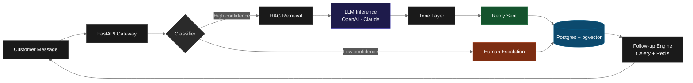

 

  

 

---

## About

Engineer working across **AI, automation, and full-stack development** — the kind who notices the manual process everyone's quietly tolerating and quietly replaces it with code.

My work spans backend systems, AI integrations, automation pipelines, web and mobile interfaces, and the data architecture that holds them together. Less interested in shortcuts, more interested in figuring out what a system *should* look like before writing the first line.

The interesting engineering challenge isn't making the AI work — it's making it know when *not to*.

 

<table>
<tr>
<td align="center" width="33%">

 <b>Production Systems</b>
 SaaS platforms running for real users
</td>
<td align="center" width="33%">

 <b>Applied AI</b>
 RAG · agents · multi-tenant inference
</td>
<td align="center" width="33%">

 <b>Full Stack</b>
 Backend · web · mobile · data
</td>
</tr>
</table>

---

## Currently Shipping — RehXa

> **An autonomous AI agent that handles WhatsApp & Email for businesses, 24/7.**
> [rehxa.com](https://rehxa.com)

A multi-tenant B2B SaaS platform that ingests business knowledge, connects to customer messaging channels, and deploys AI agents that reply with full conversational context, brand-accurate tone, and confidence-gated escalation.

<b>🏗️ &nbsp; Architecture & Engineering Decisions</b>

 

| Layer | Stack | Why |
|---|---|---|
| **API** | FastAPI (Python 3.11+) | Async-first, Pydantic validation, OpenAPI by default |
| **Database** | Supabase Postgres + pgvector | Row-level multi-tenant isolation by `org_id`; vector search co-located with relational data |
| **Background Jobs** | Celery + Redis | Knowledge ingestion, embedding generation, follow-up scheduling — never blocks the request path |
| **AI Inference** | OpenAI (primary) + Anthropic Claude (fallback) | Provider-redundant; per-org system prompts; confidence scoring on every response |
| **OAuth & Email** | Composio | Bypasses 6-week Google OAuth verification; unified Gmail / Outlook surface |
| **WhatsApp** | Meta Cloud API (Embedded Signup) | Per-org access tokens; webhook-driven ingestion |
| **Billing** | Lemon Squeezy | Merchant-of-record; handles global VAT and trials |
| **Frontend** | Next.js 14 App Router · Tailwind · shadcn/ui | Server components for dashboard, edge runtime for marketing |

**Engineering principles applied:**
- Strict per-org data isolation enforced at the **query layer**, not just the API layer
- All long-running operations offloaded to Celery — request path stays fast
- Confidence-gated AI: every response carries a 0.0–1.0 score, sub-threshold replies escalate to a human
- Pre-launch security audit completed; load tested with Locust at 50 concurrent users sustained

<b>⚡ &nbsp; Live System Capabilities</b>

 

- Unified inbox across WhatsApp + Email with real-time conversation threading
- RAG over uploaded business documents (up to 500MB per tenant)
- Per-tenant tone and personality calibration from sample writing
- Automatic multilingual handling — language detected from inbound message
- Follow-up engine running on cron-driven Celery beat
- Team accounts with role-based assignment
- GDPR-compliant data export and deletion

 

&nbsp;

> *Source code is private. Architecture documentation and a video walkthrough available on request.*

---

## Selected Work

### Production Software

<table>
<tr>
<td width="50%" valign="top">

**[RehXa](https://rehxa.com)** — *Live*

Multi-tenant AI customer-message platform. Reads, classifies, and replies to Gmail & WhatsApp messages 24/7 — grounded in the customer's own knowledge base.

`FastAPI` `Supabase` `pgvector` `Celery` `Next.js` `Composio` `WhatsApp Cloud API`

</td>
<td width="50%" valign="top">

**[DevScope](https://github.com/RHEXorg)**

AI developer assistant — debugging, doc generation, and OCR-driven context capture for codebases that need to be understood quickly.

`OpenRouter` `OCR` `Tailwind`

</td>
</tr>
</table>

### Applied AI Tooling

| Project | What it does |
|---|---|
| **Excel AI Insights** | Tabular ingestion → automated summarization & chart generation |
| **Resume Optimizer** | Embedding-based JD-to-resume alignment scoring |
| **YouTube Summarizer** | Transcript chunking, chapter generation, semantic compression |
| **Website Chatbot** | Site-scoped RAG with custom embeddings |
| **Feedback Analyzer** | Review clustering, pain-point extraction, sentiment trends |

### Mobile Engineering

| App | Surface area |
|---|---|
| **Habity** | Habit tracking — streaks, 2FA, cloud sync, in-app help center |
| **MoneyMate** | Real-time FX conversion across 150+ currencies |
| **OilHub** | Pakistan-first engine oil marketplace (UI prototype) |

---

## Engineering Stack

#### Languages

  

#### Backend & Data

  

#### Frontend & Mobile

  

#### AI & Infra

  
  
  
  
  
  

#### Deployment & Ops

  

---

## Inside the Workshop

<table>
<tr>
<td align="center" width="25%">

 Active codebases
</td>
<td align="center" width="25%">

 Primary languages
</td>
<td align="center" width="25%">

 Engineering surface
</td>
<td align="center" width="25%">

 Always
</td>
</tr>
</table>

 

### Pinned Work

  

### What I Build, In One Picture

The RehXa pipeline — simplified.

---

## How I Work

<table>
<tr>
<td width="50%" valign="top">

#### 🎯 &nbsp; Production-first
Every system is built to ship, scale, and survive real users. No demos, no toy code.

#### 🔒 &nbsp; Security on day one
Pre-launch audits, RLS, encryption at rest and in transit — not afterthoughts.

</td>
<td width="50%" valign="top">

#### 📊 &nbsp; Observability by default
Structured logging, load testing, error budgets. If it runs, it's measured.

#### ✂️ &nbsp; Lean architecture
No premature abstraction. No frameworks chosen for résumé reasons.

</td>
</tr>
</table>

---

## Open to Conversations About

- **Production AI systems** — RAG pipelines, agentic workflows, LLM cost optimization
- **Multi-tenant SaaS architecture** — from schema design to billing integration
- **Mobile applications** — React Native, App Store & Play Store delivery
- **Engineering roles** where the work is technical, the standards are high, and the impact is real

 

&nbsp;

&nbsp;

  

Engineering teams ship products. I do both.

